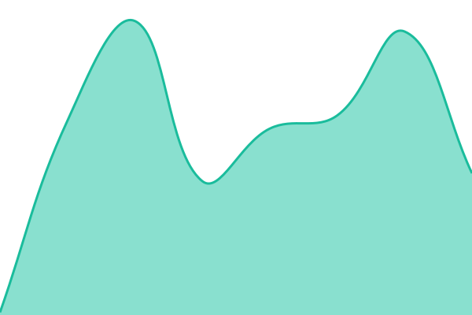

# [📈 Live Status](https://upptime.github.io/upptime): <!--live status--> **🟩 All systems operational**

This repository contains the open-source uptime monitor and status page for [Upptime](https://upptime.js.org), powered by [Upptime](https://github.com/upptime/upptime).

With [Upptime](https://upptime.js.org), you can get your own unlimited and free uptime monitor and status page, powered entirely by a GitHub repository. We use [Issues](https://github.com/upptime/upptime/issues) as incident reports, [Actions](https://github.com/trungtrandb/upptime/actions) as uptime monitors, and [Pages](https://upptime.github.io/upptime) for the status page.

<!--start: status pages-->
<!-- This summary is generated by Upptime (https://github.com/upptime/upptime) -->
<!-- Do not edit this manually, your changes will be overwritten -->
<!-- prettier-ignore -->
| URL | Status | History | Response Time | Uptime |
| --- | ------ | ------- | ------------- | ------ |
|  [Google](https://www.google.com) | 🟩 Up | [google.yml](https://github.com/trungtrandb/uptime/commits/HEAD/history/google.yml) | 

 85ms
     
 | 

<a href="https://trungtrandb.github.io/uptime/history/google">100.00%</a>
    

|  [Admin page](https://vuexy.trungtq.site) | 🟩 Up | [admin-page.yml](https://github.com/trungtrandb/uptime/commits/HEAD/history/admin-page.yml) | 

 3803ms
     
 | 

<a href="https://trungtrandb.github.io/uptime/history/admin-page">24.99%</a>
    

|  [Blog Page](https://trungtq.site) | 🟩 Up | [blog-page.yml](https://github.com/trungtrandb/uptime/commits/HEAD/history/blog-page.yml) | 

 1324ms
     
 | 

<a href="https://trungtrandb.github.io/uptime/history/blog-page">96.80%</a>
    

|  [API](https://api.trungtq.site/auth/test) | 🟩 Up | [api.yml](https://github.com/trungtrandb/uptime/commits/HEAD/history/api.yml) | 

 810ms
     
 | 

<a href="https://trungtrandb.github.io/uptime/history/api">96.89%</a>
    

|  [Argo](https://argo.trungtq.site) | 🟩 Up | [argo.yml](https://github.com/trungtrandb/uptime/commits/HEAD/history/argo.yml) | 

 808ms
     
 | 

<a href="https://trungtrandb.github.io/uptime/history/argo">96.99%</a>
    

|  [Huynhnhumakeup](https://huynhnhumakeup.art) | 🟩 Up | [huynhnhumakeup.yml](https://github.com/trungtrandb/uptime/commits/HEAD/history/huynhnhumakeup.yml) | 

 1392ms
     
 | 

<a href="https://trungtrandb.github.io/uptime/history/huynhnhumakeup">97.09%</a>
    

<!--end: status pages-->

[**Visit our status website →**](https://upptime.github.io/upptime)

## 📄 License

- Powered by: [Upptime](https://github.com/upptime/upptime)
- Code: [MIT](./LICENSE) © [Anand Chowdhary](https://anandchowdhary.com), supported by [Pabio](https://pabio.com)
- Data in the `./history` directory: [Open Database License](https://opendatacommons.org/licenses/odbl/1-0/)
